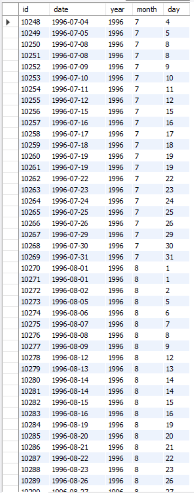
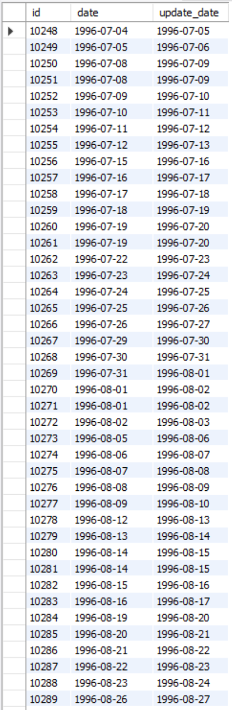
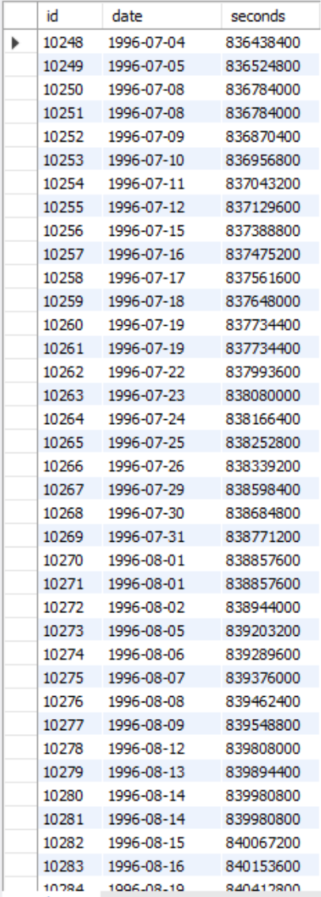
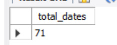
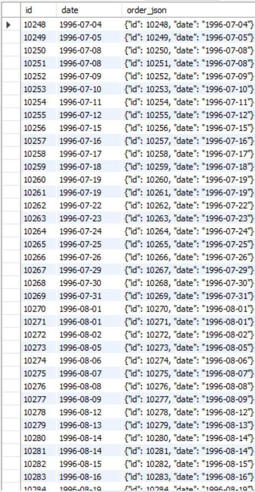

# Date (HW5)

## Content

- [Task1](#Task1)
- [Task2](#Task2)
- [Task3](#Task3)
- [Task4](#Task4)
- [Task5](#Task5)

## Task1

Write an SQL query that extracts the year, month, and date from the date attribute for the orders table. Display them in three separate attributes along with the id attribute and the original date attribute (there will be 5 attributes in total).


SQL queries:

``` mysql 
    use hw2;

    SELECT id, 
        date,
        YEAR(date) as year,
        MONTH(date) as month,
        DAY(date) as day
    FROM orders;
```

Result:




## Task2

Write an SQL query that adds one day to the date attribute for the orders table. Display the id attribute, the original date attribute, and the addition result on the screen.

SQL queries:

``` mysql 
   use hw2;

    SELECT id, 
        date,
        DATE_ADD(date, INTERVAL 1 DAY) as update_date
    FROM orders;
```

Result:




## Task3

Write an SQL query that displays the number of seconds since the start of the countdown for the orders table for the date attribute (shows its timestamp value). To do this, you need to find and apply the necessary function. Display the id attribute, the original date attribute and the result of the function on the screen.

SQL queries:

``` mysql 
    use hw2;

    SET @time_begin = '1970-01-01 00:00:00 UTC';

    SELECT id, 
        date,
        TIMESTAMPDIFF(SECOND, @time_begin, TIMESTAMP(date)) as seconds
    FROM orders;
```

or

``` mysql 
    use hw2;

    SELECT id, 
        date,
        UNIX_TIMESTAMP(date) as seconds
    FROM orders;
```

Result:




## Task4

Write an SQL query that counts how many rows in the orders table have a date attribute between 1996-07-10 00:00:00 and 1996-10-08 00:00:00.

SQL queries:

``` mysql 
    use hw2;

    SET @from_date = '1996-07-10 00:00:00';
    SET @to_date = '1996-10-08 00:00:00';

    SELECT COUNT(date) as total_dates
    FROM orders
    WHERE date BETWEEN @from_date AND @to_date;
```

Result:




## Task5

Write an SQL query that displays the id attribute, the date attribute, and the JSON object {"id": <string id attribute>, "date": <string date attribute>} for the orders table. Use the function to create a JSON object.

SQL queries:

``` mysql 
    use hw2;

    SELECT id,
        date,
        JSON_OBJECT('id', id, 'date', date) as order_json
    FROM orders;
```

Result:

